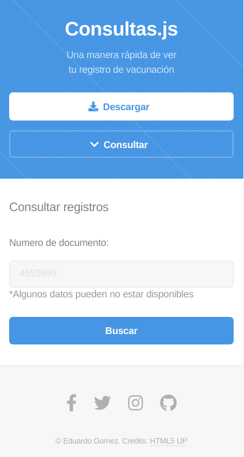
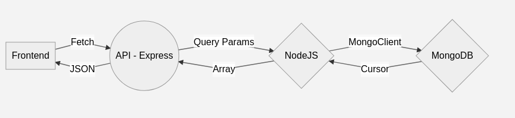

# VacundosPy
Un proyecto que busca mejorar el acceso a los registros de vacunación

Link al deploy [Vacunados](https://educardenas97.github.io/Vacunados)
(educardenas97.github.io/Vacunados)


**Frontend**



# Ejecución
Se necesita NodeJS y MongoDB para ejecutar la API. 
El archivo se encuentra en el directorio ./backend/core

    node index.js

**Dependencias**
| Paquete |Version utilizada  |
|--|--|
| express |4.17.1 |
|mongodb|4.0.1|


## Arquitectura

```mermaid
stateDiagram-v2
A[Frontend] -- Fetch --> B((API - Express))
B -- JSON --> A
C -- Array --> B
B -- Query Params--> C{NodeJS}
D -- Cursor --> C
C -- MongoClient --> D{MongoDB}
```
