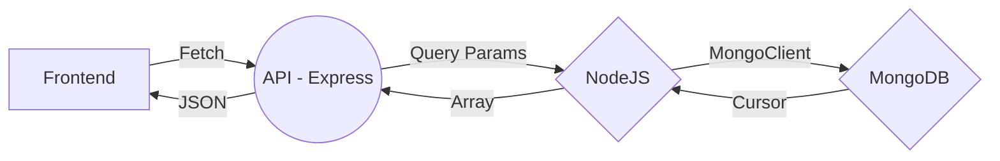

# VacundosPy
Un proyecto que busca mejorar el acceso a los registros de vacunación

**Frontend**

# Ejecución
Se necesita NodeJS y MongoDB para ejecutar la API. 
El archivo se encuentra en el directorio ./backend/core

    node index.js

**Dependencias**
| Paquete |Version utilizada  |
|--|--|
| express |4.17.1 |
|mongodb|4.0.1|

## Arquitectura

